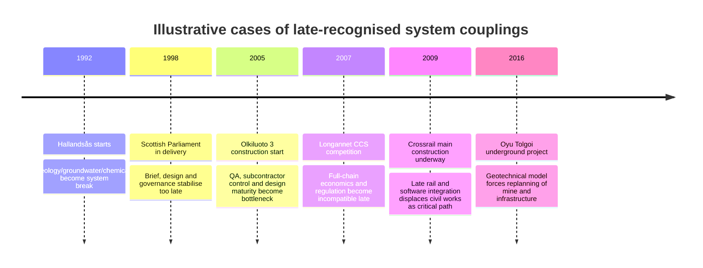

# Systems Thinking in Large-Scale Projects

## Executive Summary

The most robust cases show a consistent pattern: large projects rarely fail or derail primarily because of a single technical error. The real driver is **interfaces** between engineering, regulation, operations, financing, supply chain, and stakeholders that are recognized too late. That is where the "second- and third-order effects" arise—effects that were not in scope during early project definition and later undermine the business case, schedule, or ability to obtain approvals. Crossrail, Olkiluoto 3, Flamanville 3, Vogtle, Longannet CCS, and the NHS NPfIT programme illustrate this especially clearly. cite turn1search9 turn33search0 turn33search2 turn4search15 turn5search9 turn6search7 turn7news25 turn37view0 turn31search0 turn31search1

Across sectors, six recurring failure classes can be distinguished: **legal-regulatory externalities**, **FOAK and design-maturity problems**, **integration and interface failures**, **supply-chain and workforce bottlenecks**, **stakeholder/social-licence gaps**, and **fragmented governance**. Projects with late regulatory learning such as Longannet, projects with insufficient design maturity such as Olkiluoto, Flamanville, and Vogtle, and integration programmes such as Crossrail and NPfIT illustrate these classes particularly clearly. cite turn37view0 turn4search15 turn5search1 turn5search9 turn6search0 turn6search7 turn7news25 turn9search4 turn33search0 turn31search7

The most effective countermeasures are not single tools but an **early system architecture of the full value stream**: end-to-end value-chain mapping, explicit interface ownership, legal-regulatory due diligence, reference classes and optimism-bias corrections, Monte Carlo-based schedule/cost simulation, early integration and operational-readiness evidence, supply-chain readiness checks, and structured multi-stakeholder reviews. Official lessons-learned documents from DOE, GAO, NAO, Crossrail Learning Legacy, and the German Federal Court of Auditors (Bundesrechnungshof) support exactly this direction. cite turn9search0 turn9search4 turn18search22 turn31search10 turn33search5 turn33search8 turn19search18

For a future `skill.md`, the most important design decision is therefore: **The skill must never treat project definition as asset definition alone.** It must systematically force the user to think from the built object to the full chain: feedstock or emitters, grids, storage, permits, taxes/levies, operating models, data flows, acceptance, maintenance, supplier capability, social acceptance, and exit/fallback logic. These mandatory questions would have significantly reduced the later damage in several of the cases examined. cite turn37view0 turn31search7 turn33search0 turn16view0 turn17search10

## Curated Case Studies

The table prioritises cases with the best-documented official or quasi-official sources available. Where public data are not harmonised or not reliably comparable, this is marked as **"not stated"**. For ongoing or cancelled projects, final costs sometimes refer to **the latest reliable forecasts** or **costs incurred up to cancellation**.

| Project | Country | Period | Budget vs. Final Cost | Delay | Overlooked Systemic Effect | Authoritative Sources and Type |
|---|---|---:|---:|---:|---|---|
| Hallandsås Tunnel | Sweden | 1992–2015 | approx. SEK 1 bn → approx. SEK 10.5 bn | approx. 18 years vs. early 5-year plan | Geology, groundwater, and toxic injection agents were not modelled as a coupled ground/environment/permitting issue; environmental consequences made the project politically and technically redefinable. | Trafikverket-related report; project documentation; technical report cite turn20search0 turn22search0 turn22search12 |
| Crossrail / Elizabeth line | United Kingdom | 2009–2022 | £14.8 bn → approx. £18.9 bn | approx. 3.5 years | Civil works were mastered earlier than system integration; the interplay of signalling, railway operations, station systems, safety assurance, and thousands of physical/digital assets was underestimated. | NAO report; Crossrail Learning Legacy; TfL/NAO context cite turn1search9 turn33search0 turn33search2 |
| Big Dig | USA | 1991–2007 | approx. US$2.6 bn → approx. US$14.6 bn | approx. 9 years | Utility relocations, contract and scope growth, urban traffic management, environmental conditions, and late design changes were not managed as an integrated system risk. | National Academies; FHWA; PMI case study cite turn18search19 turn18search1 turn18search11 |
| Sydney Opera House | Australia | 1959–1973 | AU$7 m → AU$102 m | approx. 10 years | Construction began before design, construction methods, and interior programme were sufficiently frozen; architectural vision, structural engineering, and delivery logic diverged. | Sydney Opera House; NSW Treasury; NSW data cite turn28search0 turn28search1 turn28search19 |
| Scottish Parliament Building | United Kingdom | 1998–2004 | £50 m construction / £90 m total approach → £431 m | approx. 3 years | Brief, design, procurement, and governance started too early and stabilised too late; scope, quality, and political visibility created persistent feedback loops. | Scottish Parliament; Audit Committee; parliamentary history cite turn29search1 turn29search0 turn30search0 turn30search1 |
| NHS National Programme for IT | United Kingdom | 2002–2011/13 | £11.4 bn → final £9.8 bn forecast, but with material excluded residual costs | approx. 9 years until effective wind-down | Centralisation ignored clinical workflows, trust autonomy, interoperability, and local change capability; the nominally lower final estimate also reflected scope reduction rather than genuine success. | PAC report; NAO; DoH/Wachter Review cite turn31search0 turn31search1 turn31search7 |
| Olkiluoto 3 EPR | Finland | 2005–2023 | approx. €3 bn → approx. €11 bn | >14 years | FOAK design, subcontractor control, quality management, and regulatory documentation were not understood as a full system of design maturity, manufacturing, and oversight. | Reuters; STUK; STUK investigation report cite turn4search15 turn5search7 turn5search9 |
| Flamanville 3 EPR | France | 2007–2024 | approx. €3.3 bn → €13.2 bn | approx. 12 years | Welds, material conformity, supplier oversight, and regulatory rework showed that manufacturing, quality assurance, and safety demonstration were not integrated end to end. | ASN; Cour des comptes; Reuters/EDF context cite turn6search0 turn6search1 turn6search7 |
| Vogtle 3 & 4 | USA | 2009–2024 | approx. US$14 bn → approx. US$30 bn project cost | approx. 7 years | Immature design, immature supply chain, weak QA, scarce skilled workforce, and later exogenous shocks hit a FOAK model without robust integration reserve. | Reuters; Georgia Power; DOE cite turn7news25 turn7search1 turn9search4 |
| Longannet CCS | United Kingdom | 2007–2011 | £1 bn state funding cap; DECC estimated approx. £1.9 bn lifetime capital cost; project cancelled | cancelled; target operation 2014 missed | Full chain of capture, transport, storage, electricity market, and carbon price floor could not be made financeable; funding logic, contracts, and business case collided late. | NAO; Reuters/DECC cite turn37view0 turn36search0 |
| Mongstad full-scale CCS | Norway | 2006–2013 | not stated; >NOK 6 bn in TCM test centre, full-scale project cancelled | approx. 7 years until cancellation | Political "moonshot" was set before reliable techno-economic scaling; capture technology, commercial deployment logic, and risk profile were insufficiently synchronised. | Reuters; Gassnova/TCM; CLIMIT/Gassnova cite turn11search0 turn12search7 turn12search16 |
| Gorgon CCS | Australia | 2016–2019+ | not stated | approx. 3 years until CO₂ injection start | Capture, reservoir, and water/pressure management were not ramped up robustly as a coupled overall system; CO₂ was available but injection was not reliably parallel. | Chevron; Environmental Performance Reports cite turn10search1 turn10search7 turn10search9 |
| Oyu Tolgoi Underground | Mongolia | 2016–2023 | US$5.3 bn → US$6.5–7.2 bn | 16–30 months | Approved mine design was based on insufficiently understood geotechnical conditions; ore-handling logic, infrastructure, and construction sequence were therefore systemically mis-coupled. | Rio Tinto Update; Rio Tinto Funding/Forecast cite turn16view0 turn16view1 |
| Pascua-Lama | Chile / Argentina | 2009–2018 | US$2.8–3.0 bn → US$8.0–8.5 bn | at least approx. 2 years, then suspension/closure | Water, glacier, permitting, and community risks were subordinated to engineering; the project tipped from construction delay into regulatory non-viability. | Barrick 2009; Barrick 2012; Reuters/Court outcome cite turn17search1 turn16view3 turn17search10 |
| Nimrod MRA4 | United Kingdom | 1996–2010 | not stated → >£3.4–4.0 bn until cancellation | >8 years / 114 months | Reuse of old airframes plus new mission systems was treated as a product rather than an integration programme; capability, fleet size, cost, and residual utility drifted apart. | NAO; MOD; NAO overview cite turn32search4 turn32search3 turn32search12 |

## Patterns of Systemic Failure

The case studies point not to "bad project management" in a vague sense but to **specific systemic blind spots**. The first is **legal-regulatory non-integration**: Longannet failed because funding caps, carbon price floor, and contract architecture only became visible late as an incompatible overall system; Pascua-Lama was effectively made unbuildable by environmental and court decisions; Flamanville showed that regulatory quality assurance must be treated not as an annex but as the core of the project path. cite turn37view0 turn17search10 turn6search0 turn6search7

The second blind spot is **build-before-design-freeze**. Sydney Opera House, Olkiluoto 3, Flamanville 3, and Vogtle show four variants of the same pattern: political or strategic pressure for visible start meets insufficiently mature design, incompletely validated manufacturing paths, or immature supply chains. The result is not only more rework but a qualitatively different project with newly created dependencies. cite turn28search0 turn4search15 turn5search9 turn6search1 turn7news25 turn9search4

The third blind spot is **late integration economics**. Crossrail and NPfIT are textbook cases for how many subsystems can appear "green" while the overall system is not yet operational. For Crossrail it was signalling, station systems, operational assurance, and safe commissioning; for NPfIT the coupling of central IT architecture with real clinical processes, local trusts, and heterogeneous legacy systems. In both cases the real risk was not component failure but **system-of-systems failure**. cite turn33search0 turn33search2 turn33search5 turn31search0 turn31search7

A fourth blind spot is **physical-social coupling**. Hallandsås and Pascua-Lama show that geology, water, chemistry, environmental law, and local legitimacy are not external boundary conditions but productive parts of the system. Once the project treats them only as downstream permitting or communication issues, "risk" becomes a new system boundary. cite turn20search0 turn22search12 turn17search10

A fifth blind spot is **governance fragmentation**. Scottish Parliament, Big Dig, and Crossrail each suffered in different ways from responsibility for scope, cost, quality, and interfaces not being aligned in organisation. Fragmented accountability is especially dangerous in megaprojects because it hides systemic risks precisely where multiple contracts, organisations, or political levels meet. cite turn29search0 turn30search0 turn18search19 turn33search0

The upshot is therefore: **The more a project depends on adjacent systems, the less an asset-centred scope definition is adequate.** Capital projects framed as physical construction tasks although their success depends on market rules, regulatory interpretation, supply-chain capability, operating routines, or social legitimacy almost inevitably build part of their failure in from the start. cite turn37view0 turn33search0 turn31search7 turn9search4

## Prevention Methods and Frameworks

Official guides and lessons-learned documents repeatedly emphasise the same levers: sufficient design maturity before critical commitments, integrated technical and organisational interface management, realistic cost and schedule risk analysis, correction of over-optimism, and better collaboration across organisational boundaries. This is especially clear in DOE lessons learned on nuclear projects, the GAO Cost Estimating Guide, NAO work on over-optimism, Crossrail's integration and test legacy documents, and the Bundesrechnungshof on partnership-based project models. cite turn9search0 turn9search4 turn18search22 turn31search10 turn33search5 turn33search8 turn19search18

| Method / Framework | What it is good for | Strengths | Limitations | Suitable for | Effort | Example tools / artefacts |
|---|---|---|---|---|---|---|
| End-to-End Value-Chain Mapping | Complete mapping of input, asset, operations, output, acceptance, disposal/storage | Makes up/downstream dependencies visible early | Often done superficially | CCS, energy, mining, logistics | Medium | Value-chain map, SIPOC, System Context Map |
| System-of-Systems Architecture | Define technical and organisational couplings | Good against "component green, system red" | Requires disciplined interface owners | Rail, IT, defence, plant engineering | High | Architecture views, N2 matrix, Interface Register |
| ConOps / Operating Model Design | Anchor operational reality already in definition | Prevents engineering without operating logic | Underestimated when only technical teams are involved | Transport, IT, terminal/plant operations | Medium | ConOps, day-in-the-life scenarios, ORAT |
| Legal-Regulatory Due Diligence | Permits, levies, liability, classifications, subsidies, tax/transfer | Defuses late legal surprises | Highly jurisdiction-dependent | CCS, energy, mining, public infrastructure | Medium | Regulatory map, permit register, tax/legal memo |
| Business Case Scenario Analysis | Stress-test market, price, policy, and demand | Shows business-case fragility | Can remain non-binding without clear triggers | Energy, CCS, mining, transport | Medium | Scenario matrix, sensitivities, trigger table |
| System Dynamics / Causal Loop Mapping | Make feedback loops and non-linear effects visible | Very good for 2nd/3rd-order effects | Modelling effort, facilitation required | Megaprojects with many actors | Medium to high | Causal-loop diagrams, stock-flow models |
| Monte Carlo Cost/Schedule Risk Analysis | Distributions instead of point estimates | Excellent against false certainty | Only as good as the assumptions | All capital-intensive projects | Medium | Risk-adjusted estimate, S-curves, P50/P80 |
| Reference Class Forecasting / Optimism-Bias Uplifts | Outside view on cost and schedule | Effective against systematic purposeful optimism | Needs good comparison classes | Public megaprojects, FOAK projects | Low to medium | Reference-class database, uplift table |
| Supply-Chain and Workforce Readiness Assessment | Check suppliers, manufacturing, QA, and skills | Decisive for FOAK and modular projects | Often politically uncomfortable | Nuclear, defence, EPC, energy | Medium | Supplier heat map, QA maturity audit, craft-labour plan |
| Multi-Stakeholder Design Workshops | Surface conflicts between operator, regulator, municipalities, EPC, financiers | Promotes shared system boundaries | Without hard decision rules, only "good conversations" | Infrastructure, CCS, socially contested sites | Low to medium | Structured workshops, pre-mortems, red-team sessions |
| Bow-Tie / Barrier Analysis | Make critical top events and protection barriers explicit | Especially strong for high-impact risks | Better for few critical risks | HSE-intensive projects, CCS, tunnels, mining | Low to medium | Bow-tie diagrams, barrier register |
| Integrated Test/Simulation Environments | Test integration before field commissioning | Massively reduces late surprises | Build costs time and money | Rail, IT, defence, automation | High | System integration facility, test rigs, digital shadow |
| Digital Twin / BIM-GIS Integration | Consistency of design, construction, asset data, and operations | Good for geometry-, asset-, and maintenance-heavy systems | Not a substitute for governance or business-case tests | Construction, infrastructure, plants | High | BIM 4D/5D, GIS twin, asset graph |
| Portfolio and Platform Thinking | Couple single project to network/cluster logic | Avoids suboptimal point solutions | Hard to anchor in single-project financing | CCS clusters, grids, transport systems | Medium to high | Cluster roadmap, platform strategy, network view |
| Independent Red Team / Stage-Gate Challenge | Force early hard counter-review | Reduces sponsor-team blindness | Often politically unpopular | All critical megaprojects | Low to medium | Gate pack, kill criteria, challenge memo |

A toolbox alone is not enough in practice. A sensible **minimal stack** for early definition is: **Value-Chain Map + Regulatory Map + Interface Register + ConOps + Scenario Stress Test + Monte Carlo + Reference Class + Supply-Chain Readiness + Independent Red Team**. Everything else is an amplifier, not a substitute. cite turn18search22 turn31search10 turn33search8 turn37view0 turn9search4

## Heuristics for a Future skill.md

The following list is deliberately worded so it can be transferred relatively directly into rules, checklists, or prompt blocks for a `skill.md`. It condenses the recurring lessons learned from the case studies and the methods above. cite turn37view0 turn33search0 turn31search7 turn9search4 turn18search22

| Rule ID | Short Rule | Rationale | Trigger Conditions | Example Prompts / Checks |
|---|---|---|---|---|
| SYS-01 | **Always map the full chain, not just the asset.** | Many failures occurred outside the built object itself. | Every project with multiple interfaces, especially CCS/energy/IT | "Show me upstream, core asset, downstream, operations, regulation, and exit path." |
| SYS-02 | **Ask about 2nd- and 3rd-order effects.** | Systemic damage usually comes indirectly. | When scope is described narrowly or linearly | "What follow-on effects arise for grid, operations, tax, permitting, neighbourhood, maintenance?" |
| SYS-03 | **No FID without Regulatory Map.** | Late legal/levy findings destroy business cases. | Cross-border projects, CCS, energy, mining | "List permits, classifications, levies, liability, subsidy and tax issues." |
| SYS-04 | **No critical construction commitment without design-maturity threshold.** | Build-before-design-freeze is a core overrun pattern. | FOAK, complex architecture, modular construction | "Which 20 open design points could move cost/schedule by >10%?" |
| SYS-05 | **Every critical interface needs an owner and an evidence artefact.** | Unmanaged interfaces become the critical path late. | More than one EPC/supplier/authority/operator involved | "Which interfaces are mission-critical, who owns them, how is maturity demonstrated?" |
| SYS-06 | **Separate point estimate and risk-adjusted estimate.** | Point budgets create false certainty. | Board papers, public approvals, early business case | "Give me base case, P50, P80, main drivers of spread." |
| SYS-07 | **Use outside view before sponsor view.** | Internal teams systematically underestimate duration and effort. | Public megaprojects, first-of-a-kind | "Which reference class fits, and what uplift does it imply?" |
| SYS-08 | **Model the integration phase as its own megaproject.** | Integration is almost always planned too late and too small. | Rail, IT, defence, automated plants | "Which system tests, operational trials, and safety-case steps are still missing?" |
| SYS-09 | **Separate readiness checks for supply chain and workforce.** | Immature supply chain is not a procurement topic but a system risk. | FOAK, nuclear, EPC, modular projects | "Which top-10 suppliers or trades are single points of failure?" |
| SYS-10 | **Stakeholders are part of the system, not the communications fringe.** | Without social licence, projects tip into legal or political paths. | Environmental/land-use conflicts, visible infrastructure | "Who can delay the project, how, from when, with what legitimacy?" |
| SYS-11 | **Stress-test the business case under policy, price, and demand stress.** | Fragile economics do not survive real paths. | CCS, energy, commodities, transport | "What happens at carbon price ±50%, demand -20%, rates +200bp, permit +24 months?" |
| SYS-12 | **Define kill criteria explicitly.** | Without exit criteria, weak projects run into sunk-cost traps. | Politically visible projects, high prestige pressure | "At which three findings must scope, sequence, or the project itself be stopped?" |
| SYS-13 | **Evaluate operations and maintenance already in definition.** | Many problems arise only in ORAT, maintenance, or handover. | Asset-intensive projects | "How will the system be operated, maintained, handed over with data backing, and financed?" |
| SYS-14 | **Always treat FOAK as a learning programme, not a series project.** | FOAK needs more reserve, governance, and knowledge building. | New technologies, CCS/nuclear/defence | "Which assumptions are FOAK-specific, which would only be robust in NOAK?" |
| SYS-15 | **Escalate cluster/platform questions to portfolio level.** | Single projects rarely solve network problems optimally. | CCS, transport hubs, grids, digital platforms | "Is this a standalone asset or part of a platform? What shifts if I optimise portfolio instead of project?" |

When this rule set is transferred into a skill, the skill should not only generate questions but **actively flag omissions**—for example: "full chain not modelled", "regulatory due diligence missing", "interface owner unknown", "integration evidence not available", "outside view missing", "kill criteria not defined". These negative signals are more valuable for early definition than a seemingly clean scope statement. cite turn31search10 turn33search5 turn19search18

## Prioritised Sources and Limitations

For deeper work, I would read these sources first because they either provide **primary root-cause analyses** or translate directly into **transferable methods**:

| Source | Why prioritise |
|---|---|
| NAO, **Crossrail – a progress update** + Crossrail Learning Legacy | One of the strongest primary cases for late system integration and ORAT/safety assurance. cite turn33search0 turn33search5 turn33search8 |
| NAO, **Carbon capture and storage: lessons from the competition** | Excellent primary case for missing full-chain economics, funding architecture, and market/regulation coupling. cite turn37view0 |
| PAC/NAO, **National Programme for IT in the NHS** | Very good primary case for socio-technical mis-steering, centralisation, and scope/interoperability. cite turn31search0 turn31search1 turn31search2 |
| STUK reports on **Olkiluoto 3** | Concrete primary documents on subcontractor control, QA, and design/manufacturing problems. cite turn5search1 turn5search9 turn5search7 |
| ASN + Cour des comptes on **Flamanville 3** | Strong on regulatory material and manufacturing oversight as well as governance learning in nuclear projects. cite turn6search0 turn6search1 turn6search8 |
| GAO, **Cost Estimating and Assessment Guide** | Most practical standard work on robust cost/schedule models, Monte Carlo, and estimate quality. cite turn18search22 |
| NAO, **Over-optimism in government projects** | Central reference for outside view and optimism-bias correction. cite turn31search10 |
| DOE / US official lessons on **Vogtle/AP1000** | Good for design maturity, supply chain, and workforce readiness in FOAK programmes. cite turn9search0 turn9search4 |
| Bundesrechnungshof, **Partnership-based project delivery models** | Relevant for when collaborative delivery models really help—and when they do not. cite turn19search18 |

### Open Questions and Limitations

The case studies are informative, but **cost definitions are not fully harmonised**: sometimes pure capex, sometimes capex plus financing, sometimes forecasts or cancellation costs are reported. For some cancelled CCS and defence projects, "final costs" are only partially comparable in public sources. The patterns are therefore significantly more robust than false precision to the last decimal place.

For later implementation in a `skill.md`, that is not a disadvantage. On the contrary: the skill should treat these **comparability and definition problems** as a check field in its own right and force the user to make cost basis, scope basis, schedule basis, and success definition explicit.
