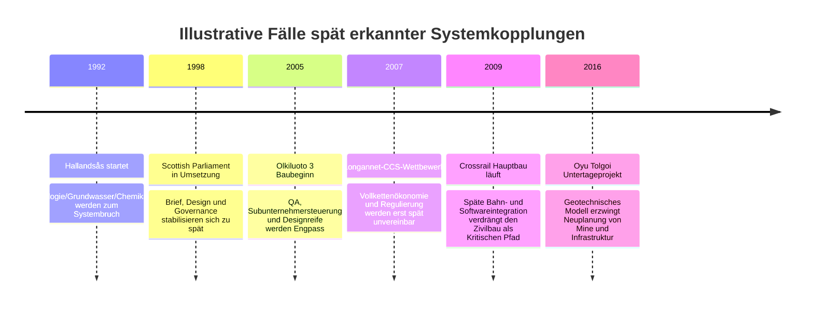

# Systemisches Denken in Großprojekten

## Management Summary

Die belastbarsten Fälle zeigen ein konsistentes Muster: Große Projekte scheitern oder entgleisen selten primär an einem einzelnen technischen Fehler. Der eigentliche Treiber sind spät erkannte **Schnittstellen** zwischen Technik, Regulierung, Betrieb, Finanzierung, Lieferkette und Stakeholdern. Genau dort entstehen die „zweiten und dritten Ordnungseffekte“, die in der frühen Projektdefinition nicht im Scope waren – und später Business Case, Terminplan oder Genehmigungsfähigkeit unterminieren. Das zeigen besonders klar Crossrail, Olkiluoto 3, Flamanville 3, Vogtle, Longannet CCS und das NHS-NPfIT-Programm. citeturn1search9turn33search0turn33search2turn4search15turn5search9turn6search7turn7news25turn37view0turn31search0turn31search1

Über Sektoren hinweg lassen sich sechs wiederkehrende Fehlerklassen unterscheiden: **rechtlich-regulatorische Externalitäten**, **FOAK- und Designreifeprobleme**, **Integrations- und Interface-Versagen**, **Lieferketten- und Arbeitskräfteengpässe**, **Stakeholder-/Social-Licence-Lücken** und **fragmentierte Governance**. Projekte mit spätem Regulierungslernen wie Longannet, Projekte mit unzureichender Designreife wie Olkiluoto, Flamanville und Vogtle, sowie Integrationsprogramme wie Crossrail und NPfIT illustrieren diese Klassen besonders deutlich. citeturn37view0turn4search15turn5search1turn5search9turn6search0turn6search7turn7news25turn9search4turn33search0turn31search7

Die wirksamsten Gegenmaßnahmen sind keine Einzeltools, sondern eine **frühe Systemarchitektur des Gesamtwertstroms**: End-to-End-Value-Chain-Mapping, explizite Interface-Verantwortung, rechtlich-regulatorische Due Diligence, Referenzklassen und Optimism-Bias-Korrekturen, Monte-Carlo-basierte Termin-/Kostensimulation, frühe Integrations- und Betriebsreife-Nachweise, Supply-Chain-Readiness-Prüfungen und strukturierte Multi-Stakeholder-Reviews. Offizielle Lessons-Learned-Dokumente von DOE, GAO, NAO, Crossrail Learning Legacy und dem Bundesrechnungshof untermauern genau diese Stoßrichtung. citeturn9search0turn9search4turn18search22turn31search10turn33search5turn33search8turn19search18

Für ein künftiges `skill.md` ist die wichtigste Designentscheidung deshalb: **Das Skill darf Projektdefinition nie nur als Asset-Definition behandeln.** Es muss den Nutzer systematisch zwingen, vom Bauobjekt zur Vollkette zu denken: Feedstock oder Emittenten, Netze, Speicher, Genehmigungen, Steuern/Abgaben, Betriebsmodelle, Datenflüsse, Abnahme, Instandhaltung, Lieferantenfähigkeit, gesellschaftliche Akzeptanz und Exit-/Fallback-Logik. Genau diese Zwangsfragen hätten bei mehreren der untersuchten Fälle den späteren Schaden deutlich reduziert. citeturn37view0turn31search7turn33search0turn16view0turn17search10

## Kuratierte Fallstudien

Die Tabelle priorisiert Fälle mit möglichst gut dokumentierten offiziellen oder quasi-offiziellen Quellen. Wo öffentliche Daten nicht harmonisiert oder nicht belastbar vergleichbar sind, ist dies als **„nicht angegeben“** markiert. Bei laufenden oder abgebrochenen Vorhaben beziehen sich Endkosten teils auf **zuletzt belastbare Forecasts** oder **bis zur Einstellung aufgelaufene Kosten**.

| Projekt | Land | Zeitraum | Budget vs. Endkosten | Verzögerung | Übersehener systemischer Effekt | Autoritative Quellen und Typ |
|---|---|---:|---:|---:|---|---|
| Hallandsås-Tunnel | Schweden | 1992–2015 | ca. SEK 1 Mrd. → ca. SEK 10,5 Mrd. | ca. 18 Jahre ggü. frühem 5‑Jahres-Plan | Geologie, Grundwasser und toxische Injektionsmittel wurden nicht als gekoppelte Baugrund-/Umwelt-/Genehmigungsfrage modelliert; die Umweltfolgen machten das Projekt politisch und technisch neu definierbar. | Trafikverket-naher Bericht; Projektunterlage; Fachbericht citeturn20search0turn22search0turn22search12 |
| Crossrail / Elizabeth line | Vereinigtes Königreich | 2009–2022 | £14,8 Mrd. → ca. £18,9 Mrd. | ca. 3,5 Jahre | Zivile Bauwerke wurden früher beherrscht als die Systemintegration; unterschätzt wurden das Zusammenwirken von Signaltechnik, Bahnbetrieb, Stationssystemen, Safe-Assurance und Tausenden physischen/digitalen Assets. | NAO-Bericht; Crossrail Learning Legacy; TfL/NAO-Kontext citeturn1search9turn33search0turn33search2 |
| Big Dig | USA | 1991–2007 | ca. US$2,6 Mrd. → ca. US$14,6 Mrd. | ca. 9 Jahre | Utility-Relocations, Vertrags- und Scope-Wachstum, urbane Verkehrsführung, Umweltauflagen und späte Designänderungen wurden nicht als integriertes Systemrisiko geführt. | National Academies; FHWA; PMI-Fallstudie citeturn18search19turn18search1turn18search11 |
| Sydney Opera House | Australien | 1959–1973 | AU$7 Mio. → AU$102 Mio. | ca. 10 Jahre | Mit dem Bau wurde begonnen, bevor Design, Bauverfahren und Innenraumprogramm ausreichend eingefroren waren; architektonische Vision, Statik und Delivery-Logik liefen auseinander. | Sydney Opera House; NSW Treasury; NSW-Daten citeturn28search0turn28search1turn28search19 |
| Scottish Parliament Building | Vereinigtes Königreich | 1998–2004 | £50 Mio. Baukosten / £90 Mio. Gesamtansatz → £431 Mio. | ca. 3 Jahre | Brief, Design, Beschaffung und Governance waren zu früh gestartet und zu spät stabilisiert; Scope, Qualität und politische Sichtbarkeit erzeugten dauerhafte Rückkopplungen. | Scottish Parliament; Audit Committee; Parlamentshistorie citeturn29search1turn29search0turn30search0turn30search1 |
| NHS National Programme for IT | Vereinigtes Königreich | 2002–2011/13 | £11,4 Mrd. → zuletzt £9,8 Mrd. Forecast, jedoch mit wesentlichen ausgeklammerten Restkosten | ca. 9 Jahre bis faktischer Abbau | Zentralisierung ignorierte klinische Workflows, Trust-Autonomie, Interoperabilität und lokale Veränderungsfähigkeit; die nominell niedrigere Endschätzung spiegelte auch Scope-Reduktion statt echten Erfolg. | PAC-Bericht; NAO; DoH/Wachter Review citeturn31search0turn31search1turn31search7 |
| Olkiluoto 3 EPR | Finnland | 2005–2023 | ca. €3 Mrd. → ca. €11 Mrd. | >14 Jahre | FOAK-Design, Subunternehmersteuerung, Qualitätsmanagement und regulatorische Dokumentation wurden nicht als volles System aus Designreife, Fertigung und Aufsicht verstanden. | Reuters; STUK; STUK-Untersuchungsbericht citeturn4search15turn5search7turn5search9 |
| Flamanville 3 EPR | Frankreich | 2007–2024 | ca. €3,3 Mrd. → €13,2 Mrd. | ca. 12 Jahre | Schweißnähte, Materialkonformität, Lieferantenaufsicht und regulatorische Nacharbeiten zeigten, dass Fertigung, Qualitätssicherung und Sicherheitsnachweis nicht end-to-end integriert waren. | ASN; Cour des comptes; Reuters/EDF-Kontext citeturn6search0turn6search1turn6search7 |
| Vogtle 3 & 4 | USA | 2009–2024 | ca. US$14 Mrd. → ca. US$30 Mrd. Projektkosten | ca. 7 Jahre | Unfertiges Design, unreife Supply Chain, schwache QA, knapper Fachkräftepool und spätere exogene Schocks trafen auf ein FOAK-Modell ohne robuste Integrationsreserve. | Reuters; Georgia Power; DOE citeturn7news25turn7search1turn9search4 |
| Longannet CCS | Vereinigtes Königreich | 2007–2011 | £1 Mrd. staatlicher Förderdeckel; DECC schätzte ca. £1,9 Mrd. Lifetime Capital Cost; Projekt eingestellt | abgebrochen; Zielbetrieb 2014 verfehlt | Vollkette aus Capture, Transport, Storage, Strommarkt und Carbon-Price-Floor wurde nicht finanzierbar zusammengebracht; Förderlogik, Verträge und Business Case kollidierten spät. | NAO; Reuters/DECC citeturn37view0turn36search0 |
| Mongstad full-scale CCS | Norwegen | 2006–2013 | nicht angegeben; >NOK 6 Mrd. in TCM-Testzentrum, Vollskalaprojekt eingestellt | ca. 7 Jahre bis Abbruch | Politischer „Moonshot“ wurde vor belastbarer techno-ökonomischer Skalierung gesetzt; Capture-Technik, kommerzielle Einsatzlogik und Risikoprofil waren nicht ausreichend synchronisiert. | Reuters; Gassnova/TCM; CLIMIT/Gassnova citeturn11search0turn12search7turn12search16 |
| Gorgon CCS | Australien | 2016–2019+ | nicht angegeben | ca. 3 Jahre bis CO₂-Injektionsstart | Capture-, Reservoir- und Wasser-/Druckmanagement wurden nicht als gekoppeltes Gesamtsystem robust hochgefahren; CO₂ war verfügbar, Injektion aber nicht parallel belastbar. | Chevron; Environmental Performance Reports citeturn10search1turn10search7turn10search9 |
| Oyu Tolgoi Underground | Mongolei | 2016–2023 | US$5,3 Mrd. → US$6,5–7,2 Mrd. | 16–30 Monate | Das genehmigte Minendesign basierte auf unzureichend verstandenen geotechnischen Bedingungen; damit waren Förderlogik, Infrastruktur und Baufolge systemisch falsch gekoppelt. | Rio Tinto Update; Rio Tinto Funding/Forecast citeturn16view0turn16view1 |
| Pascua-Lama | Chile / Argentinien | 2009–2018 | US$2,8–3,0 Mrd. → US$8,0–8,5 Mrd. | mindestens ca. 2 Jahre, danach Suspendierung/Schließung | Wasser-, Gletscher-, Genehmigungs- und Community-Risiken wurden dem Engineering nachgeordnet; dadurch kippte das Projekt von Bauverzug in regulatorische Nicht-Durchführbarkeit. | Barrick 2009; Barrick 2012; Reuters/Court outcome citeturn17search1turn16view3turn17search10 |
| Nimrod MRA4 | Vereinigtes Königreich | 1996–2010 | nicht angegeben → >£3,4–4,0 Mrd. bis Abbruch | >8 Jahre bzw. 114 Monate | Die Wiederverwendung alter Zellen plus neue Missionssysteme wurde als Produkt- statt als Integrationsprogramm behandelt; Capability, Stückzahl, Kosten und Restnutzbarkeit drifteten auseinander. | NAO; MOD; NAO-Übersicht citeturn32search4turn32search3turn32search12 |

## Muster systemischer Fehlschläge

Die Fallstudien deuten nicht auf „schlechtes Projektmanagement“ im unscharfen Sinn, sondern auf **spezifische systemische Blindstellen**. Die erste ist **rechtlich-regulatorische Nicht-Integration**: Longannet scheiterte daran, dass Förderdeckel, Carbon-Price-Floor und Vertragsarchitektur erst spät als unvereinbares Gesamtsystem sichtbar wurden; Pascua-Lama wurde durch Umwelt- und Gerichtsentscheidungen faktisch unbaubar; Flamanville zeigte, wie regulatorische Qualitätssicherung nicht als Annex, sondern als Kern des Projektpfads behandelt werden muss. citeturn37view0turn17search10turn6search0turn6search7

Die zweite Blindstelle ist **Build-before-design-freeze**. Sydney Opera House, Olkiluoto 3, Flamanville 3 und Vogtle zeigen vier Varianten desselben Musters: politischer oder strategischer Druck zum sichtbaren Start trifft auf unzureichend ausgereiftes Design, unvollständig validierte Fertigungspfade oder unreife Lieferketten. Das Resultat ist nicht nur ein Mehr an Nacharbeit, sondern ein qualitativ anderes Projekt mit neu erzeugten Abhängigkeiten. citeturn28search0turn4search15turn5search9turn6search1turn7news25turn9search4

Die dritte Blindstelle ist **späte Integrationsökonomie**. Crossrail und NPfIT sind Paradefälle dafür, dass viele Teilsysteme „grün“ wirken können, während das Gesamtsystem noch nicht betriebsfähig ist. Bei Crossrail waren es Signaltechnik, Stationssysteme, Betriebsassurance und Safe-Commissioning; bei NPfIT die Kopplung zentraler IT-Architektur mit realen klinischen Prozessen, lokalen Trusts und heterogenen Legacy-Systemen. In beiden Fällen war das eigentliche Risiko nicht Komponentenversagen, sondern **System-of-systems‑Versagen**. citeturn33search0turn33search2turn33search5turn31search0turn31search7

Eine vierte Blindstelle ist **physisch-gesellschaftliche Kopplung**. Hallandsås und Pascua-Lama zeigen, dass Geologie, Wasser, Chemie, Umweltrecht und lokale Legitimität keine externen Randbedingungen sind, sondern produktive Teile des Systems. Sobald das Projekt sie nur als nachgelagerte Genehmigungs- oder Kommunikationsfrage behandelt, wird aus „Risiko“ eine neue Systemgrenze. citeturn20search0turn22search12turn17search10

Eine fünfte Blindstelle ist **Governance-Fragmentierung**. Scottish Parliament, Big Dig und Crossrail litten jeweils auf unterschiedliche Weise darunter, dass Verantwortung für Scope, Kosten, Qualität und Schnittstellen nicht deckungsgleich organisiert war. Fragmentierte Verantwortung ist in Megaprojekten besonders gefährlich, weil sie systemische Risiken gerade dort ausblendet, wo mehrere Verträge, Organisationen oder politische Ebenen zusammentreffen. citeturn29search0turn30search0turn18search19turn33search0

Die Quintessenz lautet deshalb: **Je stärker ein Projekt von angrenzenden Systemen abhängt, desto weniger taugt eine asset-zentrierte Scope-Definition.** Kapitalprojekte, die als physische Bauaufgabe formuliert werden, obwohl ihr Erfolg von Marktregeln, regulatorischen Interpretationen, Supply-Chain-Fähigkeit, Betriebsroutinen oder sozialer Legitimität abhängt, bauen fast zwangsläufig einen Teil ihres Scheiterns mit ein. citeturn37view0turn33search0turn31search7turn9search4

## Präventionsmethoden und Frameworks

Offizielle Leitfäden und Lessons-Learned-Dokumente betonen immer wieder dieselben Hebel: ausreichende Designreife vor kritischen Commitments, integrierte technische und organisatorische Schnittstellensteuerung, realistische Kosten- und Terminrisikoanalyse, Korrektur von Over-optimism und bessere Kollaboration über Organisationsgrenzen. Besonders deutlich ist das in DOE-Lessons-Learned zu Nuklearprojekten, im GAO Cost Estimating Guide, in NAO-Arbeiten zu Over-optimism sowie in Crossrails Integrations- und Test-Legacy-Dokumenten und dem Bundesrechnungshof zu partnerschaftlichen Projektmodellen. citeturn9search0turn9search4turn18search22turn31search10turn33search5turn33search8turn19search18

| Methode / Framework | Wofür es gut ist | Stärken | Grenzen | Geeignet für | Aufwand | Beispiel-Tools / Artefakte |
|---|---|---|---|---|---|---|
| End-to-End-Value-Chain-Mapping | Vollständige Abbildung von Input, Asset, Betrieb, Output, Abnahme, Entsorgung/Storage | Macht Up-/Downstream-Abhängigkeiten früh sichtbar | Wird oft zu oberflächlich gemacht | CCS, Energie, Bergbau, Logistik | Mittel | Value-chain map, SIPOC, System Context Map |
| System-of-Systems-Architektur | Technische und organisatorische Kopplungen definieren | Gut gegen „Komponente grün, System rot“ | Erfordert disziplinierte Interface Owners | Bahn, IT, Verteidigung, Anlagenbau | Hoch | Architecture views, N2-Matrix, Interface Register |
| ConOps / Operating Model Design | Betriebsrealität schon in der Definition verankern | Verhindert Engineering ohne Betriebslogik | Unterschätzt, wenn nur Technikteams beteiligt sind | Transport, IT, Terminal-/Anlagenbetrieb | Mittel | ConOps, Day-in-the-life-Szenarien, ORAT |
| Rechtlich-regulatorische Due Diligence | Genehmigungen, Abgaben, Haftung, Klassifizierungen, Beihilfen, Tax/Transfer | Entschärft späte Legal Surprises | Stark jurisdiktionsabhängig | CCS, Energie, Bergbau, Public Infrastructure | Mittel | Regulatory map, Permit register, tax/legal memo |
| Szenarioanalyse des Business Case | Markt-, Preis-, Policy- und Demand-Stress testen | Zeigt Business-Case- Fragilität | Kann ohne klare Trigger unverbindlich bleiben | Energie, CCS, Bergbau, Transport | Mittel | Szenariomatrix, sensitivities, trigger table |
| System Dynamics / Causal Loop Mapping | Rückkopplungen und nichtlineare Effekte sichtbar machen | Sehr gut für 2./3.-Ordnungseffekte | Modellierungsaufwand, Moderationsbedarf | Megaprojekte mit vielen Akteuren | Mittel bis hoch | Causal-loop diagrams, stock-flow models |
| Monte-Carlo-Kosten-/Terminrisikoanalyse | Verteilungen statt Punktschätzungen | Exzellent gegen Scheinsicherheit | Nur so gut wie die Annahmen | Alle kapitalintensiven Projekte | Mittel | Risk-adjusted estimate, S‑Kurven, P50/P80 |
| Reference Class Forecasting / Optimism-Bias-Uplifts | Outside view auf Kosten und Termine | Wirksam gegen systematischen Zweckoptimismus | Braucht gute Vergleichsklassen | Öffentliche Großprojekte, FOAK-Projekte | Niedrig bis mittel | Referenzklassen-Datenbank, Uplift-Tabelle |
| Supply-Chain- und Workforce-Readiness-Assessment | Lieferanten, Fertigung, QA und Skills prüfen | Entscheidend bei FOAK und modularen Projekten | Häufig politisch unbequem | Nuklear, Verteidigung, EPC, Energie | Mittel | Supplier heat map, QA maturity audit, craft-labour plan |
| Multi-Stakeholder Design Workshops | Konflikte zwischen Betreiber, Genehmiger, Kommunen, EPC, Financiers offenlegen | Fördert gemeinsame Systemgrenzen | Ohne harte Entscheidungsregeln nur „gute Gespräche“ | Infrastruktur, CCS, soziale Konfliktlagen | Niedrig bis mittel | Structured workshops, pre-mortems, red-team sessions |
| Bow-Tie / Barrier Analysis | Kritische Top Events und Schutzbarrieren explizit machen | Besonders stark für High-Impact-Risiken | Eher für wenige, kritische Risiken | HSE-intensive Projekte, CCS, Tunnel, Bergbau | Niedrig bis mittel | Bow-tie diagrams, barrier register |
| Integrierte Test-/Simulationsumgebungen | Integration vor Feldinbetriebnahme testen | Reduziert späte Überraschungen massiv | Aufbau kostet Zeit und Geld | Bahn, IT, Defence, Automatisierung | Hoch | System integration facility, test rigs, digital shadow |
| Digital Twin / BIM-GIS-Integration | Konsistenz von Design, Bau, Asset-Daten und Betrieb | Gut für geometrische, asset- und maintenance-lastige Systeme | Nicht Ersatz für Governance oder Business-Case-Tests | Bau, Infrastruktur, Anlagen | Hoch | BIM 4D/5D, GIS twin, asset graph |
| Portfolio- und Plattformdenken | Einzelprojekt an Netz-/Clusterlogik koppeln | Vermeidet suboptimale Punktlösungen | Schwer in Einzelfinanzierungen zu verankern | CCS-Cluster, Netze, Verkehrssysteme | Mittel bis hoch | Cluster roadmap, platform strategy, network view |
| Independent Red Team / Stage-Gate Challenge | Früh harte Gegenprüfung erzwingen | Senkt Blindheit des Sponsorenteams | Politisch oft ungeliebt | Alle kritischen Großprojekte | Niedrig bis mittel | Gate pack, kill criteria, challenge memo |

Für die Praxis reicht kein Methoden-Bauchladen. Sinnvoll ist ein **Minimal-Stack** für die frühe Definition: **Value-Chain-Map + Regulatory Map + Interface Register + ConOps + Scenario Stress Test + Monte Carlo + Reference Class + Supply-Chain Readiness + Independent Red Team**. Alles Weitere ist Verstärker, nicht Ersatz. citeturn18search22turn31search10turn33search8turn37view0turn9search4

## Heuristiken für ein künftiges skill.md

Die folgende Liste ist bewusst so formuliert, dass sie relativ direkt in Regeln, Checklisten oder Prompt-Blöcke für ein `skill.md` übertragen werden kann. Sie kondensiert die wiederkehrenden Lessons Learned aus den Fallstudien und den obigen Methoden. citeturn37view0turn33search0turn31search7turn9search4turn18search22

| Rule ID | Kurzregel | Begründung | Triggerbedingungen | Beispiel-Prompts / Checks |
|---|---|---|---|---|
| SYS-01 | **Mappe immer die Vollkette, nicht nur das Asset.** | Viele Fehlschläge entstanden außerhalb des eigentlichen Bauobjekts. | Jedes Projekt > mehrere Schnittstellen, besonders CCS/Energie/IT | „Zeige mir Upstream, Kernasset, Downstream, Betrieb, Regulatorik und Exit-Pfad.“ |
| SYS-02 | **Frage nach 2.- und 3.-Ordnungseffekten.** | Systemische Schäden kommen meist indirekt. | Wenn Scope eng oder linear beschrieben ist | „Welche Folgewirkungen entstehen auf Netz, Betrieb, Steuer, Genehmigung, Nachbarschaft, Wartung?“ |
| SYS-03 | **Kein FID ohne Regulatory Map.** | Späte Rechts-/Abgabenfunde zerstören Business Cases. | Länderübergreifende Projekte, CCS, Energie, Bergbau | „Liste Genehmigungen, Klassifizierungen, Abgaben, Haftung, Beihilfe- und Steuerfragen.“ |
| SYS-04 | **Kein kritischer Bau-Commit ohne Designreife-Schwelle.** | Build-before-design-freeze ist ein Kernmuster von Überläufen. | FOAK, komplexe Architektur, modularer Bau | „Welche 20 offenen Designpunkte können Kosten/Termin >10% bewegen?“ |
| SYS-05 | **Jede kritische Schnittstelle braucht einen Owner und ein Beweisartefakt.** | Nicht verwaltete Interfaces werden spät zum kritischen Pfad. | Mehr als ein EPC/Supplier/Behörde/Betreiber beteiligt | „Welche Interfaces sind mission-critical, wem gehören sie, wie wird Reife nachgewiesen?“ |
| SYS-06 | **Trenne Punktschätzung und risikoadjustierte Schätzung.** | Punktbudgets erzeugen Scheinsicherheit. | Vorstandsvorlagen, public approvals, early business case | „Gib mir Base Case, P50, P80, Haupttreiber der Streuung.“ |
| SYS-07 | **Nutze Outside View vor Sponsor View.** | Interne Teams unterschätzen systematisch Dauer und Aufwand. | Öffentliche Großprojekte, First-of-a-kind | „Welche Referenzklasse passt, und welchen Uplift impliziert sie?“ |
| SYS-08 | **Modelliere die Integrationsphase als eigenes Großprojekt.** | Integration wird fast immer zu spät und zu klein geplant. | Bahn, IT, Defence, automatisierte Anlagen | „Welche Systemtests, Betriebsproben und Safety-Case-Schritte fehlen noch?“ |
| SYS-09 | **Separate Readiness Checks für Supply Chain und Workforce.** | Unreife Lieferkette ist kein Beschaffungsthema, sondern Systemrisiko. | FOAK, Nuklear, EPC, modulare Projekte | „Welche Top-10-Lieferanten oder Gewerke sind Single Points of Failure?“ |
| SYS-10 | **Stakeholder sind Teil des Systems, nicht Kommunikationsrand.** | Ohne Social Licence kippen Projekte in Rechts- oder Politikpfade. | Umwelt-/Landnutzungskonflikte, sichtbare Infrastruktur | „Wer kann das Projekt verzögern, wie, ab wann, mit welcher Legitimation?“ |
| SYS-11 | **Prüfe den Business Case unter Policy-, Preis- und Demand-Stress.** | Fragile Ökonomien halten reale Pfade nicht aus. | CCS, Energie, Rohstoffe, Verkehr | „Was passiert bei Carbon-Preis ±50%, Nachfrage -20%, Zins +200bp, Permit +24 Monate?“ |
| SYS-12 | **Definiere Kill Criteria explizit.** | Ohne Abbruchkriterien laufen schwache Projekte in sunk-cost traps. | Politisch sichtbare Projekte, hoher Prestigedruck | „Bei welchen drei Befunden muss Scope, Sequenz oder Projekt selbst gestoppt werden?“ |
| SYS-13 | **Bewerte Betrieb und Instandhaltung schon in der Definition.** | Viele Probleme entstehen erst in ORAT, Maintenance oder Hand-over. | Asset-intensive Projekte | „Wie wird das System betrieben, gewartet, data-backed übergeben und finanziert?“ |
| SYS-14 | **Behandle FOAK immer als Lernprogramm, nicht als Serienprojekt.** | FOAK braucht mehr Reserve, Governance und Wissensaufbau. | Neue Technologien, CCS/Nuklear/Verteidigung | „Welche Annahmen sind FOAK-spezifisch, welche wären erst in NOAK robust?“ |
| SYS-15 | **Eskaliere Cluster-/Plattformfragen auf Portfolioebene.** | Einzelprojekte lösen Netzprobleme selten optimal. | CCS, Verkehrsknoten, Netze, digitale Plattformen | „Ist dies ein Einzelasset oder Teil einer Plattform? Was verschiebt sich, wenn ich Portfolio statt Projekt optimiere?“ |

Wenn dieses Regelwerk in ein Skill überführt wird, sollte das Skill nicht nur Fragen generieren, sondern **Auslassungen aktiv markieren** – etwa: „Vollkette nicht modelliert“, „Regulatory Due Diligence fehlt“, „Interface Owner unbekannt“, „Integrationsnachweis nicht vorhanden“, „Outside View fehlt“, „Kill Criteria nicht definiert“. Genau diese Negativsignale sind für frühe Definition wertvoller als ein scheinbar sauber formulierter Scope. citeturn31search10turn33search5turn19search18

## Priorisierte Quellen und Grenzen

Für vertiefende Arbeit würde ich diese Quellen zuerst lesen, weil sie entweder **primäre Ursachenanalysen** liefern oder direkt **in übertragbare Methoden** übersetzen:

| Quelle | Warum priorisieren |
|---|---|
| NAO, **Crossrail – a progress update** + Crossrail Learning Legacy | Einer der stärksten Primärfälle für späte Systemintegration und ORAT/Safe-Assurance. citeturn33search0turn33search5turn33search8 |
| NAO, **Carbon capture and storage: lessons from the competition** | Exzellenter Primärfall für fehlende Vollkettenökonomie, Förderarchitektur und Markt-/Regulationskopplung. citeturn37view0 |
| PAC/NAO, **National Programme for IT in the NHS** | Sehr guter Primärfall für sozio-technische Fehlsteuerung, Zentralisierung und Scope/Interoperabilität. citeturn31search0turn31search1turn31search2 |
| STUK-Berichte zu **Olkiluoto 3** | Konkrete Primärdokumente zu Subunternehmersteuerung, QA und Design-/Fertigungsproblemen. citeturn5search1turn5search9turn5search7 |
| ASN + Cour des comptes zu **Flamanville 3** | Stark für regulatorische Material- und Fertigungsaufsicht sowie Governance-Lernen in Nuklearprojekten. citeturn6search0turn6search1turn6search8 |
| GAO, **Cost Estimating and Assessment Guide** | Praktischstes Standardwerk für robuste Kosten-/Terminmodelle, Monte Carlo und Schätzqualität. citeturn18search22 |
| NAO, **Over-optimism in government projects** | Zentrale Referenz für Outside View und Optimism-Bias-Korrektur. citeturn31search10 |
| DOE / US official lessons on **Vogtle/AP1000** | Gut für Designreife, Supply Chain und Workforce Readiness in FOAK-Programmen. citeturn9search0turn9search4 |
| Bundesrechnungshof, **Partnerschaftliche Projektabwicklungsmodelle** | Relevant für die Frage, wann kollaborative Delivery-Modelle wirklich helfen – und wann nicht. citeturn19search18 |

### Offene Fragen und Grenzen

Die Fallstudien sind aussagekräftig, aber **Kostenbegriffe sind nicht vollständig harmonisiert**: teils werden reine Capex, teils Capex plus Finanzierung, teils Forecasts oder Abbruchkosten berichtet. Bei einigen eingestellten CCS- und Verteidigungsprojekten sind „Endkosten“ öffentlich nur eingeschränkt vergleichbar. Deshalb sind die Muster deutlich robuster als eine Scheingenauigkeit auf der letzten Nachkommastelle.

Für die spätere Umsetzung in ein `skill.md` ist das kein Nachteil. Im Gegenteil: Das Skill sollte genau diese **Vergleichbarkeits- und Definitionsprobleme** selbst als Prüffeld behandeln und den Nutzer zwingen, Kostenbasis, Scope-Basis, Terminbasis und Erfolgsdefinition explizit zu machen.