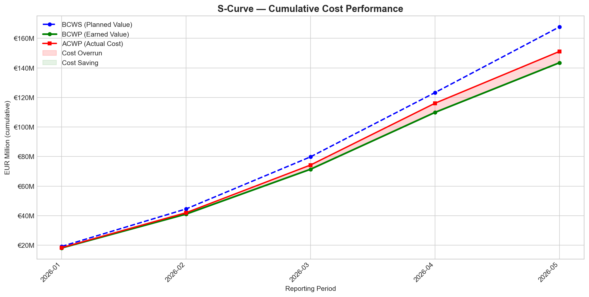
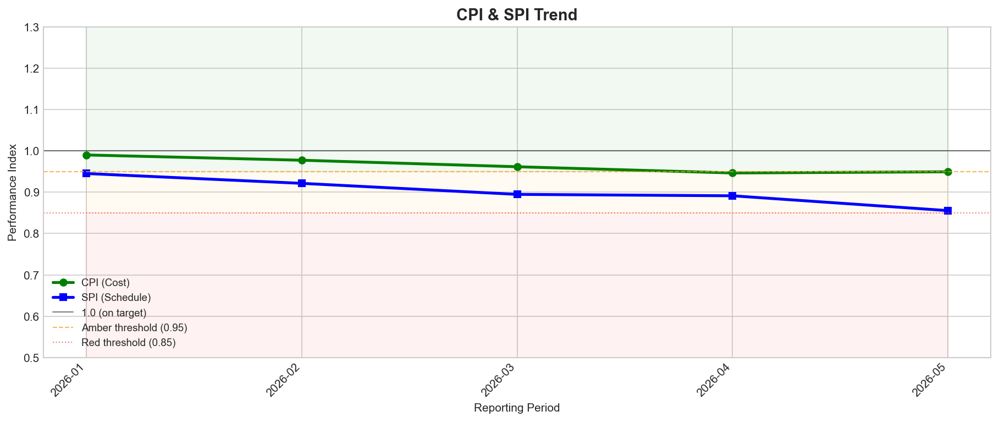
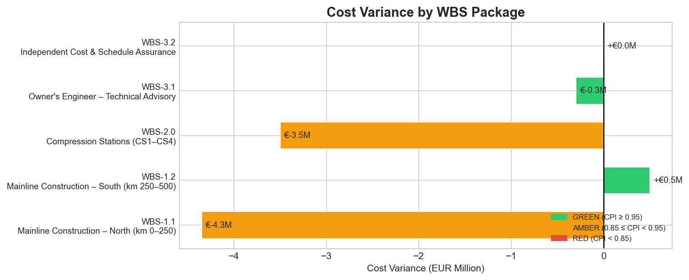
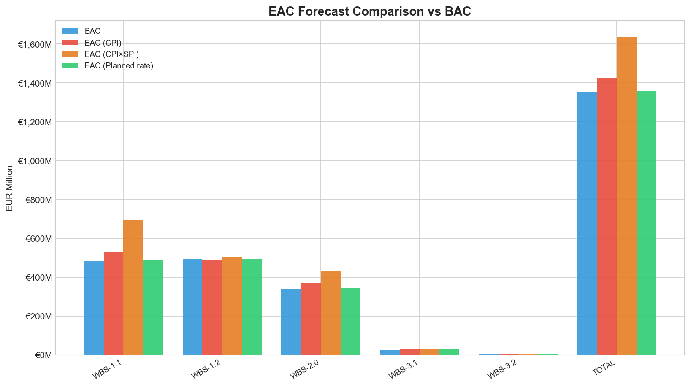
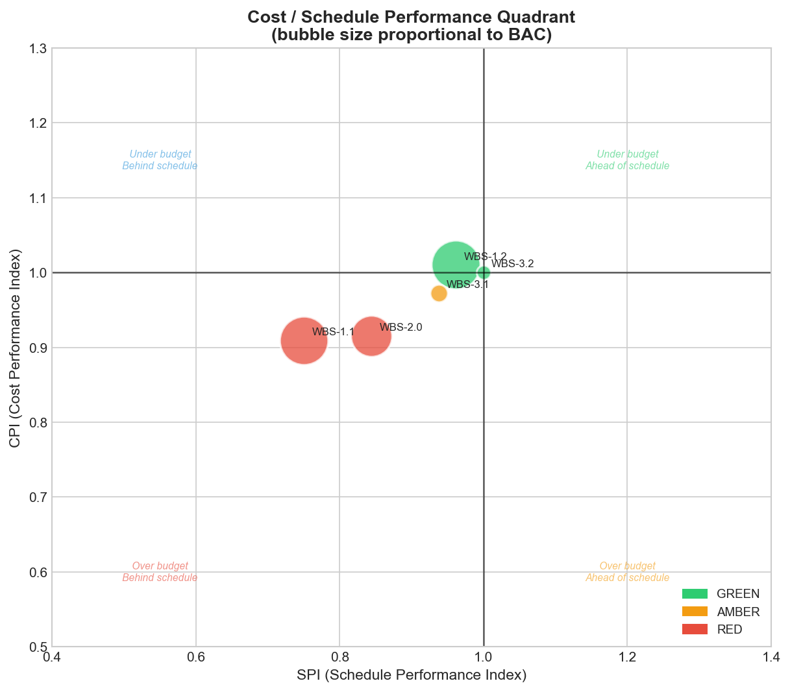

# EVM Report — GreenArtery H2 Pipeline (H2-PIPE-DE-001)
**Reporting Period:** May 2026 | **Phase:** Execution — Month 5 of ~36 | **Prepared by:** EVM Skill v1.0

---

## Executive Summary

| Metric | Value | Status |
|--------|-------|--------|
| BAC (Budget at Completion) | EUR 1,350.5M | — |
| BCWS (Planned Value) | EUR 167.8M | — |
| BCWP (Earned Value) | EUR 143.5M | — |
| ACWP (Actual Cost) | EUR 151.2M | — |
| % Complete | 10.6% | — |
| CPI (Cost Performance Index) | 0.949 | 🟡 AMBER |
| SPI (Schedule Performance Index) | 0.855 | 🟡 AMBER |
| Cost Variance | EUR −7.7M (−5.3%) | 🟡 |
| Schedule Variance | EUR −24.2M (−14.5%) | 🟡 |
| EAC — CPI method | EUR 1,422.5M | +EUR 72M vs BAC |
| EAC — Composite CPI×SPI | EUR 1,637.3M | +EUR 287M vs BAC |
| EAC — Planned rate | EUR 1,358.2M | +EUR 8M vs BAC |
| VAC (Variance at Completion) | EUR −72.0M | |
| TCPI (required future perf.) | 1.006 | ✅ Achievable |

> **Recommended EAC for board reporting:** EUR 1,637.3M (Composite CPI×SPI method).  
> For large capital projects, schedule pressure reliably compounds cost efficiency loss.  
> The CPI-only method (EUR 1,422.5M) understates risk at this stage of execution.

---

## ⚠️ Escalation Flags

- **WBS-1.1 (Mainline North):** SPI = 0.750 🔴 RED. Linepipe delivery delay (port congestion)
  is the primary driver. If SPI remains below 0.85 in the June reporting period, a written
  escalation memo to the Project Director is mandatory per project governance rules.
- **WBS-2.0 (Compression Stations):** SPI = 0.844 🟡 AMBER. CS2 foundation redesign
  (karst geology) is absorbing float. Geotechnical contingency drawn. No escalation threshold
  breached yet but under close watch.

---

## Chart 1 — S-Curve: Cumulative Cost Performance

*BCWS (planned), BCWP (earned), and ACWP (actual) plotted over five reporting periods.
The shaded red area represents cumulative cost overrun (ACWP > BCWP). The gap between
BCWS and BCWP is the schedule variance expressed in cost terms.*

**Reading this chart:** The three lines track closely through February 2026 (months 1–2,
mobilisation phase) before diverging from March onward as WBS-1.1 pipe delivery delays
reduce earned value while actual costs continue to accrue. The growing red band between the
green (earned) and red (actual) lines represents the EUR 7.7M cost overrun to date. The
widening gap between the blue planned line and the green earned line — EUR 24.2M at
period end — is the schedule variance: the project has earned EUR 24.2M less than it
planned to earn by this point.

---

## Chart 2 — CPI & SPI Trend

*Cost Performance Index (CPI) and Schedule Performance Index (SPI) plotted over five periods
against GREEN (≥0.95), AMBER (0.85–0.94), and RED (<0.85) threshold bands.*

**Reading this chart:** CPI (green line) has declined steadily from 0.99 in January to 0.949
in May, now sitting in the AMBER band. The trend direction is more important than the current
level: a CPI that is declining in early execution typically continues to decline, as IPA research
shows CPI stabilises (rather than recovers) after the 20% completion mark. SPI (blue line)
has declined more steeply, crossing the RED threshold in May at 0.855. The downward
trajectory of both indices from month 1 is a strong early warning signal that should drive a
formal recovery review before the June cutoff.

---

## Chart 3 — Cost Variance by WBS Package

*Cost Variance (BCWP − ACWP) per contract package. Negative bars = cost overrun.
Bar colour reflects the RAG status of each package's CPI.*

**Reading this chart:** WBS-1.1 (Mainline North, EUR −4.3M) and WBS-2.0 (Compression
Stations, EUR −3.5M) are the two packages driving the project-level cost overrun. Together
they account for EUR 7.8M of the EUR 7.7M total — meaning WBS-1.2 (Mainline South)
and the owner's engineer packages are effectively on budget or better. This is a critical
finding: the problem is concentrated, not spread across the portfolio. Focused intervention
on two contracts can recover the project-level CPI without broad programme disruption.
WBS-1.2's EUR +0.5M positive variance provides marginal headroom but does not offset
the WBS-1.1 and WBS-2.0 overruns.

---

## Chart 4 — EAC Forecast Comparison vs BAC

*Budget at Completion (BAC) versus three EAC forecast methods for each WBS package
and the project total. The spread between methods indicates forecast uncertainty.*

**Reading this chart:** The TOTAL column on the right tells the key story. The blue bar
(BAC, EUR 1,350.5M) is the approved budget for the contracted scope. The three EAC
bars form a range: EUR 1,358M (optimistic, planned rate — full recovery assumed) to
EUR 1,637M (conservative, composite method — schedule pressure compounds cost loss).
The spread of EUR 279M between these two methods reflects genuine uncertainty at 10.6%
completion: the project is too early to have a narrow EAC range. WBS-1.1 shows the widest
spread (BAC EUR 485M, composite EAC EUR ~700M), confirming it is the dominant driver
of project-level forecast risk. The composite EAC for WBS-1.1 alone implies a 44% overrun
on that contract if current CPI and SPI performance continues — the primary case for a
formal recovery plan.

---

## Chart 5 — Cost / Schedule Performance Quadrant

*Each WBS package plotted on the CPI (vertical) vs SPI (horizontal) quadrant. Bubble size
is proportional to Budget at Completion. Packages in the lower-left quadrant are both over
budget and behind schedule.*

**Reading this chart:** The quadrant map gives an immediate visual read of the portfolio.
WBS-1.2 (Mainline South, large green bubble, upper right) is the standout performer —
on budget and marginally ahead of schedule, and it carries the largest single contract value.
WBS-1.1 (Mainline North, large red bubble, lower left) sits deep in the danger quadrant:
both over budget (CPI 0.909) and significantly behind schedule (SPI 0.750). Its large bubble
size signals that this underperformance, if not corrected, will dominate the project total.
WBS-2.0 (Compression Stations, red bubble, lower left) is similarly distressed but at a
smaller scale. WBS-3.1 (Owner's Engineer, amber bubble) sits just below the CPI threshold,
consistent with a small cost overrun on time-and-materials advisory scope. The ideal
destination for all packages by the next reporting period is the upper-right quadrant.

---

## WBS Performance Breakdown

| WBS | Description | BAC | BCWP | ACWP | CV | CPI | SPI | Cost | Schedule |
|-----|-------------|-----|------|------|----|-----|-----|------|----------|
| WBS-1.1 | Mainline Construction — North (km 0–250) | EUR 485.0M | EUR 43.6M | EUR 48.0M | EUR −4.3M | 0.909 | 0.750 | 🟡 | 🔴 |
| WBS-1.2 | Mainline Construction — South (km 250–500) | EUR 493.0M | EUR 50.0M | EUR 49.5M | EUR +0.5M | 1.010 | 0.962 | 🟢 | 🟢 |
| WBS-2.0 | Compression Stations (CS1–CS4) | EUR 340.0M | EUR 38.0M | EUR 41.5M | EUR −3.5M | 0.916 | 0.844 | 🟡 | 🔴 |
| WBS-3.1 | Owner's Engineer — Technical Advisory | EUR 28.0M | EUR 10.5M | EUR 10.8M | EUR −0.3M | 0.972 | 0.938 | 🟢 | 🟡 |
| WBS-3.2 | Independent Cost & Schedule Assurance | EUR 4.5M | EUR 1.4M | EUR 1.4M | EUR 0.0M | 1.000 | 1.000 | 🟢 | 🟢 |
| **TOTAL** | | **EUR 1,350.5M** | **EUR 143.5M** | **EUR 151.2M** | **EUR −7.7M** | **0.949** | **0.855** | **🟡** | **🟡** |

---

## EAC Forecast Methods

| Method | Formula | EAC | ETC | VAC |
|--------|---------|-----|-----|-----|
| CPI (performance continues) | BAC ÷ CPI | EUR 1,422.5M | EUR 1,271.3M | EUR −72.0M |
| **Composite CPI×SPI** *(recommended)* | ACWP + (BAC−BCWP) ÷ (CPI×SPI) | **EUR 1,637.3M** | — | — |
| Planned rate (full recovery) | ACWP + (BAC−BCWP) | EUR 1,358.2M | — | — |

**TCPI = 1.006** — the required future CPI to finish within BAC. This is below the 1.10
danger threshold, meaning mathematical recovery is still feasible. However, the declining
trend in CPI (from 0.99 in January to 0.949 in May) indicates that without a structural
change in how WBS-1.1 and WBS-2.0 are managed, the TCPI will rise toward the danger
zone over the next two to three reporting periods.

---

## Recommended Next Actions

1. **WBS-1.1 recovery plan** — Construction Manager to present a formal schedule recovery
   plan by 20 June 2026. Plan must address: alternative pipe sourcing, acceleration of
   welding spreads, and revised critical path. If SPI < 0.85 in June reporting, escalation
   memo to Project Director is mandatory.

2. **WBS-2.0 change order assessment** — Commercial Manager to finalise assessment of
   CS2 foundation redesign change order entitlement by 30 June 2026. Cost Engineer to
   update WBS-2.0 BAC forecast accordingly.

3. **Contingency status review** — Cost Engineer to prepare contingency drawdown report
   as of May 2026 cutoff and present at the June PMT meeting. Drawdown > 50% of approved
   contingency triggers a risk register review per project governance.

4. **EAC communication to Project Director** — PM to brief Project Director on the composite
   EAC of EUR 1,637M and the range of outcomes (EUR 1,358M–1,637M). Board-level
   communication should reference the composite method as the planning basis.

5. **June data cutoff** — Cost Engineer to update `evm-timephased.csv` with June actuals
   by 5 July 2026. If the WBS-1.1 SPI does not recover above 0.85, the two-consecutive-period
   escalation rule will fire automatically in the next EVM run.

---

*Generated by `evm_calculator.py` from `evm-timephased.csv` (H2-PIPE-DE-001, period 2026-05).
Charts saved to `examples/H2-PIPE-DE-001/03-cost/evm-output/`.
Source data: [`evm-timephased.csv`](../evm-timephased.csv) | [`evm-snapshot-2026-05.csv`](../evm-snapshot-2026-05.csv)*
